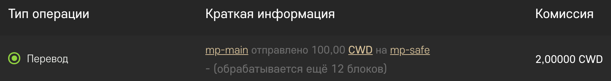
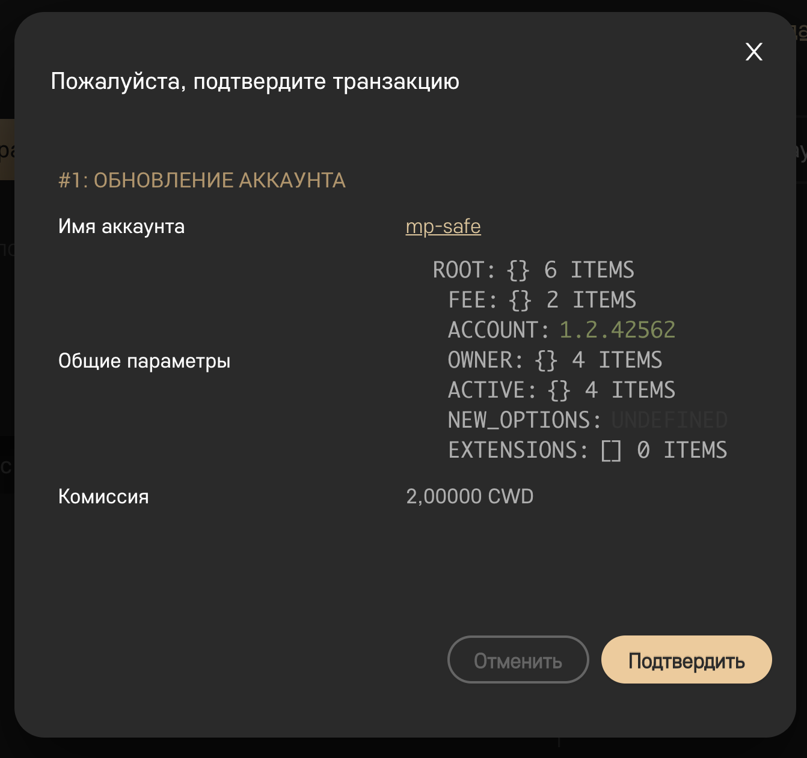

===========================================
Мультиподпись для хранения активов CrowdWiz
===========================================

Блокчейн CrowdWiz позволяет создавать аккаунты с мультиподписью (multisig, далее **мп-аккаунт**). 
То есть для того чтобы провести транзакцию с такого аккаунта, нужно, чтобы её подтвердили с нескольких других
аккаунтов (далее будем называть их **ключевые аккаунты**).
На данный момент через web-приложение можно с лёгкостью проводить такие операции с поддержкой мультиподписи:

* перевод активов
* стекинг
* вывод с вестинговых балансов

Для того чтобы совершать операции с аккаунта с мультиподписью, существует специальная операция предложенных
транзакций (proposal transaction), как с ней работать мы далее разберём на примере.

Функционал мультиподписей позволяет создавать различные системы принятия решений, документооборота и управления
структурами, но в данном руководстве мы рассмотрим наиболее простой и, наверное,
самый важный пример - **использование аккаунта с мультиподписью в роли хранилища активов**.

Аккаунта с мультиподписью в роли хранилища активов
--------------------------------------------------

В нашем примере мы будем использовать мп-аккаунт со схемой подписи **2 из 3**.
Это значит, что в настройках прав доступа мп-аккунта указаны 3 ключевых аккаунта, но для совершения операции
достаточно подписи любых 2х ключевых аккаунтов из трёх.

Для чего нужен такой аккаунт? Самое главное его предназначение, в том, что, если вы потеряете один из трёх ключей или 
он будет скомпрометирован (например, фишинг, вирус, ненадёжное хранение), вы не потеряете доступ к мп-аккаунту, и в то же время
злоумышленник не сможет получить доступ к вашим средствам, потому что у него только один аккаунт, а нужно минимум 2 из 3.

Конечно, нужно хранить свои пароли от аккаунтов в надёжном месте (использовать специальные менеджеры паролей типа KeePass),
но в реальном мире, часто бывает это невозможно.
Мы предлагаем хранить один ключ, скажем, только на телефоне, второй только на компьютере (помним про менеджеры паролей),
а третий вообще записать на бумажке и сохранить в надёжном месте и не вводить ни на одном устройстве пока он действительно не понадобится.

Таким образом, чтобы обеспечить максимальную защиту, вы на основном аккаунте храните только те средства, которые вам нужны ежедневно (CWD),
а основные накопления, инвестиционные активы типа (GCWD, DIAMOND) и вестинговые счета со стекингом создаёте уже на мп-аккаунте.
Если вам нужно совершить какие-то действия, то вы сначала переводите необходимую сумму с мп-аккаунта на основной и уже оттуда делаете то, что нужно.

Создание структуры аккаунтов для мультиподписи
----------------------------------------------

Допустим, у вас есть основной рабочий аккаунт, назовём его **mp-main**. И теперь вы хотите создать мп-аккаунт для того,
чтобы использовать его в качестве долгосрочного хранилища ваших активов. Назовём его **mp-safe** и зарегистрируем его
в структуре под аккаунтом mp-main. Мы решили, что аккаунт mp-safe будет использовать схему 2 из 3, а, значит, нам 
нужно 3 ключевых аккаунта. Одним из них будет mp-main, теперь нам нужны ещё два, назовём их mp-key1 и mp-key2 и также
зарегистрируем их в структуре под аккаунтом mp-main.

.. warning:: Важно создать аккаунты в структуре под основным аккаунтом, потому что функционал предложенных операций стекинга и вестинга доступны как раз из структуры ключевого аккаунта.

Настройка аккаунта с мультиподписью
-----------------------------------
Необходимо настроить *права доступа* аккаунта **mp-safe** таким образом, чтобы он мог совершать транзакции только, если два из трёх ключевых аккаунтов (mp-main, mp-key1 и mp-key2) подпишут эту транзакцию.

Как известно, все операции в блокчейне платные, в том числе и операция изменения аккаунта, поэтому сначала нужно перевести на аккаунт mp-safe немного CWD с основного аккаунта mp-main (или пополнить счёт через CWDex)

Для начала переведём 100 CWD c mp-main на mp-safe.

Теперь нам необходимо авторизоваться под аккаунтом mp-safe.

.. warning:: Не забывайте установить проверочное слово! И самое главное, проверяйте, что отображается именно то слово, которое вы установили!

После авторизации нам нужно перейти в настройку **прав доступа** аккаунта mp-safe на вкладку **Действующие права доступа**

Теперь нам нужно добавить наши ключевые аккаунты в права доступа и настроить порог подписания.

Для того чтобы добавить ключевой аккаунт, впишите его в поле **Имя аккаунта или ключ**, а в поле **Вес** укажите желаемый вес подписи - в нашем случае ``1``. После этого нажмите кнопку **Добавить**.

Теперь точно также нужно добавить ключевые аккаунты **mp-key1** и **mp-key2**, в итоге должен получиться следующий набор прав:

Как видно на картинке в правах доступа у нас остался базовый ключ аккаунта (у вас будет другое значение, но также будет начинаться на ``CWD...``).
Его нужно удалить из этого списка, для этого нажмите ``X`` в столбце удалить, напротив этого ключа.

Теперь нам нужно установить порог срабатывания подписи. Поскольку мы создаём аккаунт, который будет работать по принципу 2 из 3, а сумма всех весов наших ключевых аккаунтов как раз равна 3, то в поле порог мы должны указать значение ``2``.

В итоге у вас должна получиться такая картина на вкладке **Действующие права доступа**:

Теперь всё точно то же самое нужно проделать на вкладке **Права доступа владельца**:

Поле ключ примечания можно не изменять, но в этом случае вам будет сложно прочитать сообщения отправленные на мп-аккаунт, в 99% случаев при использовании аккаунта в качестве хранилища вам это не понадобится. Но в принципе, чтобы иметь возможность читать сообщения, отправленные на мп-аккаунт из под вашего основного рабочего аккаунта, можно скопировать ключ примечания в мп-аккаунт из рабочего.

Мы подошли к важному моменту - сохранению прав доступа.

.. warning:: После того как вы сохраните изменённые права доступа, авторизоваться под паролем аккаунта mp-safe больше не получится! После того как вы нажмёте кнопку Сохранить - этот аккаунт не сможет самостоятельно выполнять никакие операции!

Теперь нам нужно нажать кнопку **Сохранить** и подтвердить транзакцию.

После этого в истории операций мп-аккаунта появится операция обновления аккаунта:

Поздравляем! Аккаунт с мультиподписью создан и настроен!

Использование аккаунта с мультиподписью
---------------------------------------

Теперь попробуем использовать наш аккаунт в качестве хранилища. Для этого нам нужно проверить, что он работает, и проще всего сделать это проведя операцию перевода.

.. warning:: Не переводите большие суммы на аккаунт сразу после создания! Сначала нужно убедиться, что вы всё сделали правильно и мультиподпись работает корректно!

У нас на балансе аккаунта оставались CWD. Для теста мы выведем их обратно на свой основной аккаунт. Кстати, за операцию подписи тоже нужно заплатить комиссию,
поэтому нам нужно пополнить ключевые аккаунты, чтобы на них была достаточная сумма для оплаты комиссии. Мы переведём на аккаунт **mp-key1** 100 CWD с основного аккаунта **mp-main**.

Как мы уже говорили выше механизм работы с мультиподписью следующий:

* Один из ключевых аккаунтов (из тех, что мы добавили в права доступа) создаёт предложение для мп-аккаунта совершить операцию
* Затем тот, кто предложил, должен одобрить это предложение
* И другой ключевой аккаунт также должен одобрить это предложение

Как только предложение наберёт необходимое количество одобрений (помните, мы установили порог равный ``2``?), операция описанная в предложении будет исполнена (если на мп-аккаунте достаточно средств, чтобы оплатить комиссию)

Перевод с мультиподписью
------------------------

Создадим для примера предложение о переводе **50 CWD** с аккаунта **mp-safe** на аккаунт **mp-main**. 

Авторизуемся под одним из наших ключевых аккаунтов, для удобства будем работать с аккаунтом **mp-main**, но можно работать и с **mp-key1** или **mp-key2**.

Переходим в раздел финансы и нажимаем кнопку **Отправить средства**, а затем в появившемся окне выбираем вкладку **Предложить**

Поле предлагающий аккаунт уже заполнено, нам нужно заполнить само предложение, тут, как в обычном переводе, нужно указать от кого, кому и сумму, а примечание лучше оставить пустым.

* От кого: **mp-safe**
* Кому: **mp-main**
* Количество: **50 CWD**

Затем нужно нажать кнопку **Предложить** и подтвердить транзакцию

.. note:: Предложение имеет срок истечения, после которого оно будет уже недействительным, по умолчанию срок действия составляет 24 часа.

В истории операций нашего основного аккаунта появится новая транзакция типа **Создание предложения**

Одобрение предложенной транзакции
---------------------------------

Для того чтобы увидеть активные предложения, нужно перейти в мп-аккаунт, для этого можно нажать на имя аккаунта в mp-safe как раз в этой транзакции. Либо найти аккаунт mp-safe у себя в структуре (мы специально для этого создавали его в первой линии).

После того как вы перейдёте в профиль мп-аккаунта, вы увидите там новую кнопку **Предложенные транзакции** рядом с кнопкой **История операций**

После того как вы на неё нажмёте, появится интерфейс подтверждения преложенных транзакции:

Здесь вы увидите только что созданное предложение перевести 50 CWD с аккаунта mp-safe на mp-main. 
И статус этого предложения **Ожидающие 0/2**, это значит, что его ещё никто не одобрил.

Теперь нам нужно одобрить это предложение, поскольку мы авторизованы под аккаунтом mp-main, который является одним из ключевых для mp-safe, мы можем нажать кнопку **Подтвердить**.

Появится окно подтверждения предложения, в котором мы должны выбрать, от имени какого аккаунта мы подтверждаем данное предложение. В нашем случае выбираем **mp-main** в полях **Оплатить с аккаунта** и **Подтверждение для добавления**.

.. image:: img/16_approve_proposal_main.png
	:align: center
	:alt: 16 approve proposal main

Нажимаем **Подтвердить** и ещё раз **Подтвердить** в окне подтверждения транзакции Обновления предложения.

.. image:: img/17_approval_confirmation_main.png
	:align: center
	:alt: 17 approval confirmation main

Вы увидите, что статус предложения изменился на **Ожидающие 1/2**, то есть мы получили уже одно одобрение транзакции из двух необходимых.

Теперь нужно подписать одним из оставшихся ключевых аккаунтов - **mp-key1** или **mp-key2**. В нашем примере мы будем использовать аккаунт **mp-key1**.

Авторизуемся под аккаунтом **mp-key1**, затем переходим в свою структуру, и переходим в структуру своего спонсора **mp-main**, и находим в ней аккаунт **mp-safe** и переходим в его профиль.

Там снова переходим на вкладку с активными предложениями и опять одобряем предложение, только уже от аккаунта **mp-key1** 

После того как вы одобрите предложение, оно пропадёт из активных предложений, перевод будет выполнен и в истории операций аккаунта mp-safe появится операция перевода.

.. image:: img/21_approved_transfer.png
	:align: center
	:alt: 21 approved transfer

Если всё прошло так как описано выше, значит, мп-аккаунт настроен правильно, и вы можете начинать им пользоваться.

Стекинг с мультиподписью
------------------------

Теперь создадим предложение для стекинга на мп-аккаунте. Для этого снова авторизуемся под одним 
из ключевых аккаунтов **mp-main**.
Чтобы было что положить на стекинг, переведём минимально необходимую сумму для стекинга (250 CWD) и
комиссию за операцию стекинга (20 CWD), 270 CWD с аккаунта mp-main на аккаунт mp-safe.
Перевод на мп-аккаунт ничем не отличается от перевода на любой другой аккаунт, так что
его мы подробно рассматривать не будем.

Для того чтобы было удобнее находить наш мп-аккаунт, мы создали его в первой линии нашего основного аккаунта,
поэтому переходим в структуру, находим там наш мп-аккаунт и переходим в его структуру.

Поскольку это мп-аккаунт, а аккаунт mp-main, под которым мы в данный момент авторизованы, один из его ключевых аккаунтов,
вы увидите две дополнительные кнопки - **Предложить стекинг** и **Предложить вестинг**. 

Нажимаем кнопку **Предложить стекинг** и попадаем на привычную страницу стекинга, однако обратите внимание на то,
что доступный баланс - это баланс нашего мп-аккаунта и вместо кнопки Отправить теперь кнопка **Предложить**.

Выбираем параметры стекинга и желаемую сумму (в нашем случае на 3 месяца, 250 CWD) и нажимаем кнопку **Предложить**. 
Затем нужно подтвердить транзакцию создания предложения.

После того как вы подтвердите создание предложения, эта операция появится в истории операций аккаунта mp-main, а предложение появится в активных предложениях аккаунта mp-safe.

Теперь остаётся только одобрить наше новое предложение, процедура подтверждения идентична той, что описана в разделе **Одобрение предложенной транзакции**

Вестинг с мультиподписью
------------------------

Осталось рассмотреть последнюю доступную на данный момент операцию - вывод активов с вестингового баланса.
Для этого точно также как и в предыдущих двух случаях нужно создать предложение и одобрить его.

Находим в своей структуре мп-аккаунт (по аналогии с тем, что мы делали в разделе Стекинг с мультиподписью), и нажимаем кнопку **Предложить вестинг**.

После этого вы попадаете на страницу **Мой контракт** мп-аккаунта. 

Выбираете нужный вестинговый баланс и нажимаете кнопку **Востребовать сейчас**

Затем подтверждаете создание предложения

После того как вы подтвердите создание предложения, эта операция появится в истории операций аккаунта mp-main, а предложение появится в активных предложениях аккаунта mp-safe.

Теперь остаётся только одобрить наше новое предложение, процедура подтверждения идентична той, что описана в разделе **Одобрение предложенной транзакции**

Заключение
----------

Мы рассмотрели основные операции, которые позволяют повысить защищённость ваших активов, однако у мультиподписей гораздо более широкое применение, например, вы можете делать коллективные вклады и гибко настраивать систему утверждения решений.
